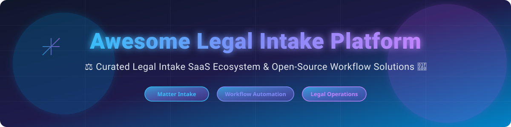

  

# ⚖️ Awesome Legal Intake Platform 🚀

  
  
  
  
  
  

## 📊 Top Legal Intake Platforms & Legal Operations Ecosystem

**Curated List of SaaS Products & Open-Source GitHub Projects for Matter Intake, Request Triage, Legal Workflow Automation, and Enterprise Legal Management (ELM)**

*Last updated: September 2026* 📅

---

### 🌐 Market Size & Industry Structure Overview

> **Market Insights & Industry Fragmentation:**  
> 📈 The global Legal Operations & Legal Service Management software sector is estimated at **$3.8 Billion - $4.5 Billion**, projecting strong expansion driven by AI adoption, legal request triage, and corporate legal workflow automation.  
> 🧩 **Market Fragmentation:** The market is **moderately fragmented**. While enterprise giants like ServiceNow and Thomson Reuters dominate large corporate legal departments, specialized legal intake and workflow automation platforms (e.g., LawVu, Onit, Checkbox, BRYTER) capture high-growth mid-market and boutique corporate legal niches.

---

## 📑 Table of Contents
- [🏢 SaaS/Hosted Platforms](#-saashosted-platforms)
- [🔓 Open-Source GitHub Projects](#-open-source-github-projects)
- [🛠️ How to Contribute](#%EF%B8%8F-how-to-contribute)
- [💖 Support & Community](#-support--community)
- [⚠️ Disclaimer](#%EF%B8%8F-disclaimer)
- [📈 Star History](#-star-history)

---

## 🏢 SaaS/Hosted Platforms

The following SaaS platforms lead the legal request intake, matter routing, legal spend tracking, and legal workflow automation space for corporate general counsel and law firms.

*Sorted by Company Size / Market Valuation / Annual Revenue (Descending):* ⬇️

| Platform | Starting Tier Pricing 💳 | Free Tier / Trial Limits ⏳ | Company Size & Valuation / Revenue 💰 | Description & Key Capabilities 💡 |
| :--- | :--- | :--- | :--- | :--- |
| **[ServiceNow Legal](https://www.servicenow.com/)** 🏢 | **$100 / user / month** *(ServiceNow Enterprise Legal Service Delivery module package standard rate)* | **14-Day Enterprise Sandbox** *(Developer instance available with full features for testing)* | **~$159B - $218B Valuation** *(~$13.28B Annual Revenue)* | Legal service management built on ServiceNow for enterprise intake, triage, and workflow routing. |
| **[Legal Tracker (Thomson Reuters)](https://legaltracker.thomsonreuters.com/)** ⚖️ | **$350 / user / month** *(Standard tier base pricing for corporate legal departments)* | **14-Day Guided Demo Trial** *(Request-based trial with sample legal data access)* | **~$45.7B - $72.1B Valuation** *(~$7.48B Annual Revenue)* | Premier legal spend, outside counsel management, and matter intake platform by Thomson Reuters. |
| **[Mitratech TAP Workflow](https://mitratech.com/)** 🏛️ | **$15,000 / year** *(Base annual enterprise package for TAP Workflow automation)* | **30-Day Enterprise Trial** *(Proof-of-concept trial available via sales enablement)* | **~$222M - $330M Revenue** *(Private Equity backed by OTPP & Hg)* | Comprehensive workflow automation and legal matter intake solution within Mitratech ELM suite. |
| **[BRYTER](https://bryter.com/)** ⚡ | **$1,000 / month** *(Starting package rate for specialized modules like NDA Suite / Workflows)* | **14-Day Interactive Sandbox Trial** *(Full no-code editor access for up to 3 test apps)* | **~$344M Valuation** *(Series B, ~$90M raised)* | Leading no-code automation platform for legal teams to build intake forms, decision trees, and workflows. |
| **[LawVu](https://lawvu.com/)** 📋 | **$500 / month** *(Starting tier for LawVu Draft / Salesforce Legal Workspace integration)* | **14-Day Free Trial** *(Full access to LawVu Legal Workspace with sample matter intake templates)* | **~$220M Valuation** *(~$20M ARR, $33M raised)* | Legal workspace platform unifying intake, matter management, contract workflow, and team collaboration. |
| **[Onit Legal Service Management](https://www.onit.com/)** 🏢 | **$20,000 / year** *(Base platform tier for enterprise legal request intake and workflow)* | **14-Day Demo Environment** *(Guided sandbox trial provided during product evaluation)* | **~$54.5M Annual Revenue** *(Raised $215M+ in funding)* | Enterprise legal workflow and intake platform with advanced automation and matter management (includes SimpleLegal). |
| **[Checkbox](https://www.checkbox.ai/)** 🤖 | **$416 / month** *(AUD $5,000 / year base entry tier for automation forms)* | **14-Day Free Trial** *(Access to no-code flow builder and AI form generator)* | **$23M Series A Raised** *(Backed by Touring Capital & Peak XV)* | No-code & AI-enhanced legal workflow platform for request intake, triage, and self-service decision logic. |
| **[SimpleLegal](https://www.simplelegal.com/)** 💵 | **$400 / month** *(Starting base software tier + variable usage rates for spend/matters)* | **14-Day Free Trial** *(Full e-billing and matter intake testing sandbox)* | **Subsidiary of Onit** *(Acquired by Onit; mid-market ELM market leader)* | Modern legal spend and matter management solution tailored for mid-market corporate legal teams. |
| **[Josef](https://joseflegal.com/)** 💬 | **$300 / month** *(Starting tier for Josef Q AI legal assistant builder)* | **14-Day Free Trial** *(Includes 100 free AI prompt executions and flow builders)* | **~$8.7M AUD Raised** *(Pre-Series A backed by OIF Ventures)* | No-code legal automation & AI platform empowering teams to build client intake bots and triage flows. |

---

## 🔓 Open-Source GitHub Projects

While enterprise legal intake is predominantly served by commercial platforms, these open-source workflow engines, low-code form builders, and legal management systems offer customizable foundations for building self-hosted legal intake and triage portals.

*Sorted by GitHub Star Count (Descending):* ⬇️

| Project & Repo Link 📌 | GitHub Stars 🌟 | Description & Capabilities 💡 |
| :--- | :--- | :--- |
| **[n8n](https://github.com/n8n-io/n8n)** ⚡ |  | Fair-code workflow automation tool. Easily configured to build automated legal request intake, Slack/Email triage, and document routing pipelines. |
| **[Appsmith](https://github.com/appsmithorg/appsmith)** 🛠️ |  | Open-source low-code platform to quickly build internal legal request dashboards, triage forms, and approval portals connected to your databases. |
| **[Certbot](https://github.com/certbot/certbot)** 🔒 |  | EFF's automated security and SSL certificate tool—essential for securing self-hosted, privilege-compliant legal intake web portals. |
| **[Budibase](https://github.com/Budibase/budibase)** 🏗️ |  | Open-source low-code application builder ideal for creating custom legal request portals, matter tracking tables, and role-based access flows. |
| **[Documenso](https://github.com/documenso/documenso)** ✍️ |  | Open-source e-signature platform that integrates seamlessly into legal intake forms for instant NDAs and approval sign-offs. |
| **[Form.io](https://github.com/formio/formio)** 📝 |  | Combined JSON schema form builder and API management platform for complex data capture and legal form intake. |
| **[Docassemble](https://github.com/jhpyle/docassemble)** ⚖️ |  | Free, open-source expert system for guided interview building, legal document assembly, and interactive intake questionnaires. |
| **[Iuris-Soft](https://github.com/createrivabu/Iuris-Soft)** 💼 |  | Open-source legal management system supporting client contacts, litigation tracking, matter lifecycles, and legal document repositories. |
| **[Whereas CLM](https://github.com/Whereas/whereas)** 📄 |  | Experimental open-source contract lifecycle management (CLM) and request-to-repository intake workflow project. |

---

### 💡 Additional Open-Source Architecture Patterns for Legal Ops

- **Form-to-Workflow Integration:** Capture legal requests via open-source form engines (Form.io / Budibase) → route using workflow tools (n8n) → auto-create matters in legal databases.
- **E-Signature & Compliance:** Integrate open signing tools (Documenso) into intake decision flows for self-service agreements.
- **Expert Guided Interviews:** Deploy Docassemble for complex legal intake trees (e.g., conflict of interest checks, GDPR data request triage).

---

## 🛠️ How to Contribute

Contributions are welcome! Help us keep this legal tech list comprehensive and accurate:

1. 🍴 **Fork** this repository.
2. 📝 **Add or edit** entries in `README.md` following the tabular format.
3. 🔎 Ensure descriptions are factual and provide explicit starting prices/limits for SaaS entries or valid GitHub repos for open-source.
4. 📥 **Submit a Pull Request** with a concise description of your changes.

---

## 💖 Support & Community

Thank you for exploring the Legal Intake Platform ecosystem! If you find this curated legal tech directory helpful, please consider supporting the project:

- 🌟 **Star** this repository to show your appreciation and help others discover it.
- 🍴 **Fork** and contribute to expand the SaaS and open-source legal technology listings.
- 📢 **Share** with legal ops professionals, general counsel teams, and legal engineers.
- ☕ **Sponsor / Buy Me a Coffee:** Support ongoing maintenance via the [GitHub Sponsor Dashboard](https://github.com/sponsors/ishandutta2007).

---

## ⚠️ Disclaimer

- This is a **community-curated** repository provided for informational purposes only.
- Legal intake platforms process highly sensitive, privileged attorney-client data. Ensure proper data protection, encryption, and legal compliance review before deploying any solution in production.

---

## 📈 Star History

---

  <b>Built for Legal Ops, General Counsel, and Law Firm Operations Teams</b> ⚖️

